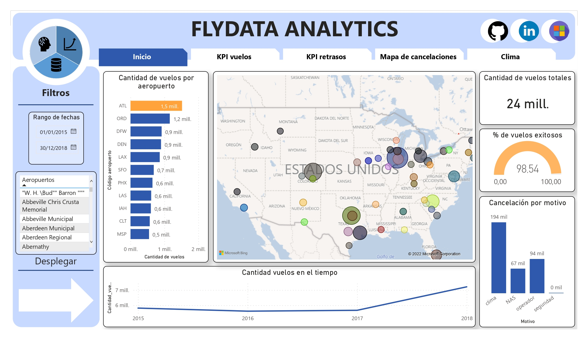
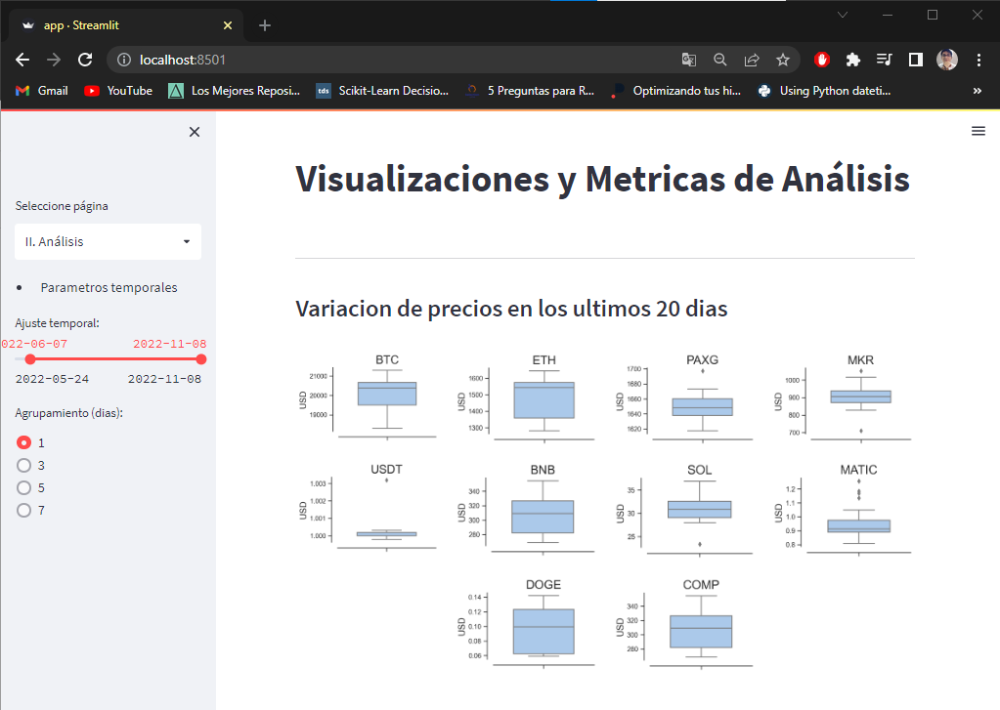
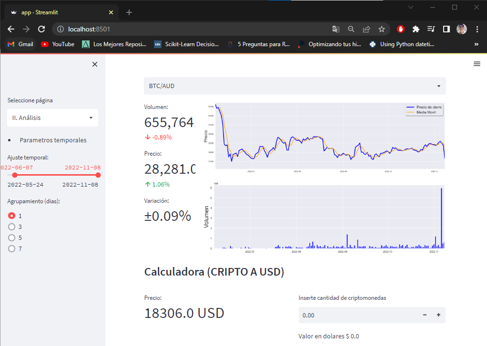

# **_Hi there, I'm Diego!_** 🏁🚀

> # **_DATA SCIENTIST AND ELECTRONIC ENGINEER STUDENT_ 🦾😎🚀**

### **Data Science = My Passion!!!**
### **My curiosity = My Tool!!!**
### **Knowledge = My way!!!**

> # **_Some projects..._**

### *FlyData Analitics*
Data architecture development using Azure Blobl Storage, Databricks and Data Factory. Connection with Power BI for the elaboration of a dashboard with historical and weather data for US airports. As extra products, an api and a machine learning model were developed to predict flight departures by location.

### *tools: Python, Power BI, Databricks, BlobStorage,etc*
---------------------------------------------------
### **Crypto Reporting**
A visual environment in streamlit was developed for the variability report of some cryptocurrency markets, exchange calculator and temporary graphs.

### *tools: Python, Streamlit, FTXapi, Seaborn, etc*
---------------------------------------------------

### *Api Data*
An api was developed for the exact request of a database
The operation of the api is described in the following video

Video: [api_video](https://www.youtube.com/watch?v=CrytQgYE8RE&t=109s&ab_channel=DiegoAlexanderCheroOlazabal)
### *tools: Python, FastAPI, PyMySQL*
---------------------------------------------------

> # ⚡***Languages and Tools:***
 

### **Python, C, Power BI, MySQL, Matlab, Databricks, Pandas, SkLearn, Streamlit, FastAPI, Meteostate** 
---------------------------------------------

> # 📫 ***CONTACT ME:***

Have a question or want to work together?

Email:      alex.ch.o573@gmail.com

Linkdin:    [www.linkedin.com/in/alexdch](www.linkedin.com/in/alexdch)
